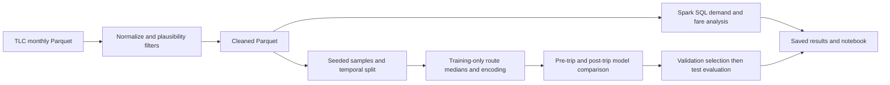
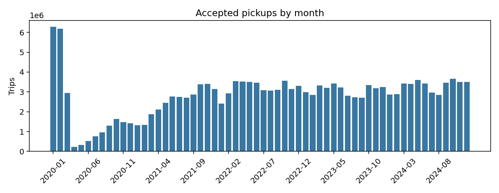
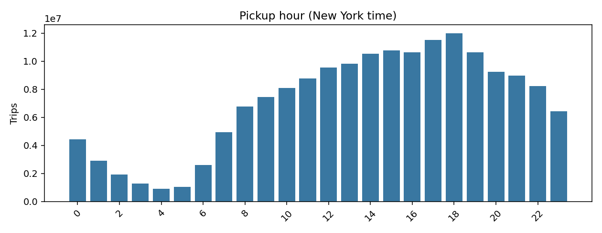
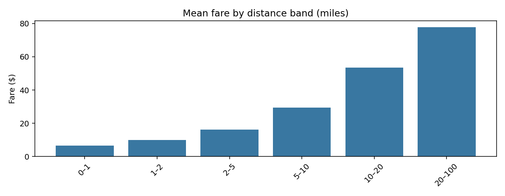
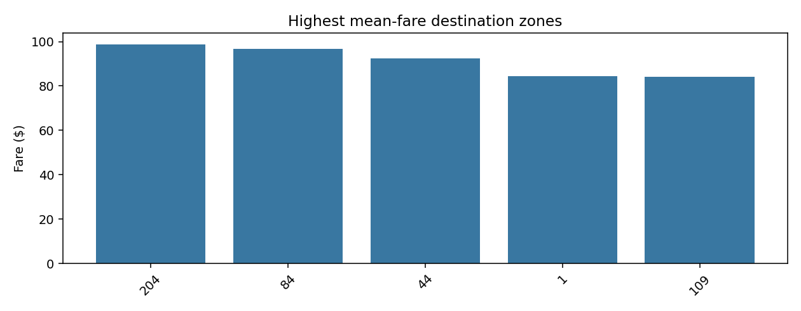

# NYC taxi fare analytics

Estimate NYC taxi fares before travel and compare those estimates with reconstruction from completed trips.

Started as coursework in my MSc big data course; extended into a full five-year pipeline.



## Key findings: yellow taxis

Yellow accepted pickups were 24,061,728 in 2020 and 39,556,497 in 2024 (+64.4%). The lowest observed month was 2020-04 (228,428 trips). This dataset starts in 2020, so it cannot measure a pre-pandemic decline.



The busiest yellow pickup hour was 18:00–18:59 New York time, with 11,988,732 accepted trips across the study.



Yellow mean recorded fare was $6.63 in the 0–1-mile band and $77.70 in the 20–100-mile band. These are descriptive averages, mixing routes and pricing periods.



Destination zone 204 had the highest yellow mean fare ($98.85, 804 trips) among mapped zones with at least 500 accepted trips. This does not adjust for trip length.



## Model results

| Fleet / setting | Selected model | MAE ($) | RMSE ($) | R² | Within $2 | Within $5 |
|---|---|---:|---:|---:|---:|---:|
| Yellow / Mean baseline | Training mean | 10.42 | 18.57 | -0.120 | 19.3% | 44.9% |
| Yellow / pre-trip | GBT | 4.29 | 8.63 | 0.758 | 42.4% | 77.7% |
| Yellow / post-trip | GBT | 2.26 | 5.42 | 0.905 | 71.9% | 90.7% |
| Green / Mean baseline | Training mean | 8.93 | 15.26 | -0.001 | 15.6% | 36.6% |
| Green / pre-trip | LinearRegression | 4.79 | 11.00 | 0.479 | 41.0% | 76.2% |
| Green / post-trip | LinearRegression | 3.36 | 8.23 | 0.709 | 55.7% | 84.9% |

Yellow pre-trip RMSE was 53.5% below its mean baseline; post-trip RMSE was 37.2% lower than pre-trip RMSE.
Both settings assume a known destination; post-trip also uses realized distance and duration, making it a reconstruction upper bound.
The known December 2022 fare-change flag is included in both settings; this comparison does not isolate its contribution or establish a causal effect.

The full local run took **16.36 minutes** with Spark 3.5.3, local[2] and a 4g driver: yellow: 169,430,105 accepted trips; green: 4,780,936 accepted trips. Modelling uses seeded samples for local-machine compute: 0.2% yellow and 5% green; yellow: 185,235 train / 73,987 validation / 79,550 test; green: 171,320 train / 36,513 validation / 30,691 test.

## How to run

Python 3.9–3.12 and Java 17 are required. From the project folder:

```bash
python3 -m venv .venv
source .venv/bin/activate
pip install -e '.[dev]'
nyc-taxi demo
pytest -q
nyc-taxi download
nyc-taxi run
```

Open [the notebook](notebooks/nyc_taxi_portfolio.ipynb) in Jupyter or VS Code and run its cells in order. It reads saved results by default; set `RECOMPUTE = True` to run the full pipeline. [Methodology](docs/methodology.md) explains the assumptions; [results](docs/results/README.md) contains the counts, comparisons and diagnostics.

## Limitations

- Local Spark demonstrates distributed APIs on one machine.
- One temporal holdout; no rolling evaluation.
- Model training and evaluation use samples, not every accepted trip.
- Positive recorded fares do not establish that payment occurred; filters exclude some legitimate unusual trips.
- Pre-trip route medians omit traffic conditions; post-trip inputs require completed trips.
- No deployed service or production monitoring.
