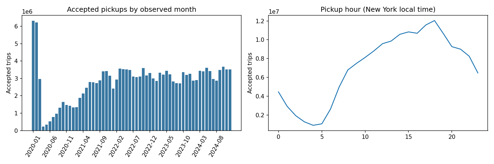
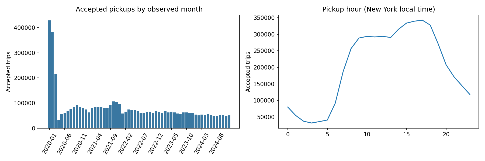
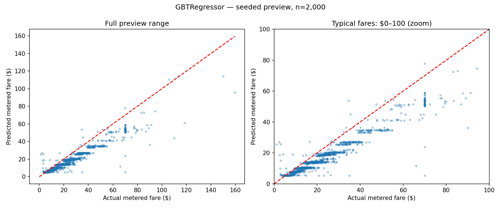
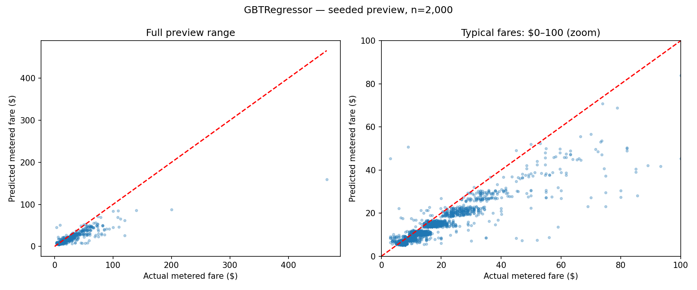

# Five-year results: NYC yellow and green taxis, 2020–2024

These are measured results from a local run over all 120 monthly source files. All accepted rows contribute to cleaning and EDA. Modeling uses separate seeded samples.

## Coverage and evaluation

| Fleet | Raw rows | Accepted rows | Base training | Selected training | Validation | Test |
|---|---:|---:|---:|---:|---:|---:|
| Yellow | 174,689,444 | 170,265,054 | 186,681 | 373,614 | 74,588 | 79,570 |
| Green | 5,090,611 | 4,845,392 | 173,992 | 347,393 | 37,329 | 31,158 |

The population is trips with positive **recorded fares**, not verified settled payments. Codes 0 and 3–6 and missing payment information remain when the other cleaning rules pass; payment type is not a model input. Zero/negative recorded fares are excluded regardless of payment code. See [payment definitions](../data.md) for the versioned meaning of code zero.

Training: 2020–2022. Validation: 2023. Test: 2024. Starting fractions: yellow 0.002, green 0.05; seed 42. The training-size comparison uses fixed validation/test samples. The selected training count can be larger than the starting count.

## Held-out performance

| Fleet | Selected model | Test RMSE ($) | Test MAE ($) | Test R² | Mean baseline RMSE ($) |
|---|---|---:|---:|---:|---:|
| Yellow | GBTRegressor | 8.44 | 5.25 | 0.770 | 18.63 |
| Green | GBTRegressor | 10.38 | 4.37 | 0.601 | 16.45 |

Only the final selected candidate is scored on the held-out test set. The target is the completed-trip metered fare, not total passenger spending or a pre-trip quote.

## Sample-size sensitivity

| Fleet | Training rows | Training fraction | Validation RMSE ($) | Validation MAE ($) |
|---|---:|---:|---:|---:|
| Yellow | 186,681 | 0.0020 | 8.43 | 4.99 |
| Yellow | 373,614 | 0.0040 | 8.41 | 5.00 |
| Green | 173,992 | 0.0500 | 23.45 | 4.21 |
| Green | 347,393 | 0.1000 | 23.38 | 4.19 |

The larger candidate uses the same selected regression family, with preprocessing fitted again on the larger training set. This assesses the complete training procedure at two sizes; it does not isolate sample count from changes in learned vocabularies and caps.

## Extreme-error investigation

| Fleet | Uncapped linear validation RMSE ($) | Capped linear validation RMSE ($) | Worst 20 share of uncapped squared error |
|---|---:|---:|---:|
| Yellow | 9.88 | 9.31 | 15.9% |
| Green | 23.70 | 23.47 | 86.5% |

Distance/duration feature inputs are capped at training-set 99.9th percentiles. Raw records and fare labels are retained. The uncapped comparison uses identical base train/validation records. The table measures sensitivity to the caps; it does not prove that every extreme record is erroneous. Worst-residual CSVs expose the measurements for inspection.

## Analytical findings

### Yellow findings

- The busiest observed pickup hour was 18:00, with 12,038,929 accepted trips across the period.
- Accepted trips totaled 24,207,122 in 2020 and 39,704,245 in 2024. These describe this cleaned TLC population, not all NYC transport demand.
- Median metered fare was $11.40; the 75th percentile was $18.40, while the maximum was $998,310.03. The tail warrants separate evaluation.
- Among records explicitly coded as card or cash, the most frequent payment method was credit card. Other entries describe fare regime, payment status or missing/unknown information, and remain in the analysis.

### Green findings

- The busiest observed pickup hour was 17:00, with 342,628 accepted trips across the period.
- Accepted trips totaled 1,661,843 in 2020 and 623,953 in 2024. These describe this cleaned TLC population, not all NYC transport demand.
- Median metered fare was $13.50; the 75th percentile was $21.90, while the maximum was $4,003.00. The tail warrants separate evaluation.
- Among records explicitly coded as card or cash, the most frequent payment method was credit card. Other entries describe fare regime, payment status or missing/unknown information, and remain in the analysis.

## Reproducing the earlier verification failure

A separate January–March 2024 diagnostic rerun reproduces the earlier yellow linear-regression failure on exactly the same split counts: 28,888 training and 29,150 validation records.

The largest residual came from a record with **6,860.8 miles in 38.6 minutes**, an actual fare of **$32.50**, and an uncapped prediction of **$18,057.03**. Those measurements are highly inconsistent with an ordinary taxi trip and caused extreme linear extrapolation.

On identical train/validation records, training-only input caps changed linear-regression validation RMSE from **$105.71 to $5.32**. The worst 20 records contributed 99.8% of uncapped squared error. This is a diagnostic comparison, not the main five-year performance result and not a test-score claim.

Reproduce with `python -m nyc_taxi.investigate`. Compact evidence is in `verification-error-investigation/`. Its additional runtime is recorded separately in `investigation.json`.

## Temporal pricing context

TLC increased the taxi/SHL meter fare structure effective 19 December 2022, near the end of the training period. [Official TLC notice](https://www.nyc.gov/assets/tlc/downloads/pdf/industry-notices/industry_notice_22_02_english.pdf). Most training trips therefore precede the new price structure, whereas validation and test trips follow it. This is a plausible contributor to underestimation visible in the plots, not a measured causal attribution. An explicit pricing-regime feature or a rolling retraining experiment is a future extension; neither was included in these scores.

## Measured local runtime

Processing wall time: **15.3 minutes**, excluding download and notebook rendering.

| Fleet | Load/clean/Parquet (min) | SQLite snapshot (min) | EDA (min) | Modeling (min) |
|---|---:|---:|---:|---:|
| Yellow | 5.7 | 0.2 | 2.8 | 3.9 |
| Green | 0.7 | 0.1 | 0.1 | 1.7 |

Environment: Python 3.9.6, Spark 3.5.3, local[2], 4 GB driver setting, New York timezone. Complete Java and operating-system details are in `experiment.json`. No clustered benchmark is claimed.

## Storage and limitations

All accepted trips are persisted in cleaned Parquet. SQLite is a bounded snapshot of at most 100,000 rows per fleet; it is not the five-year data warehouse and is not used for modeling or EDA. Full export is configurable when disk space permits.

These are fixed-seed local results, with modest fixed model settings and one temporal holdout. They do not quantify uncertainty across repeated samples. Filtering nonpositive recorded fares excludes zero/negative fare values but does not necessarily exclude trips coded no charge or dispute, and source data accuracy is not guaranteed. Feature caps can suppress real long-distance behavior; fare-band diagnostics and full-range plots make remaining tail errors visible.

Prediction plots use up to 2,000 seeded hash-selected test records. The zoomed view excludes fares beyond $100 visually, but the full view and metrics retain them. Drop-off rankings require at least 500 trips.

## Charts

